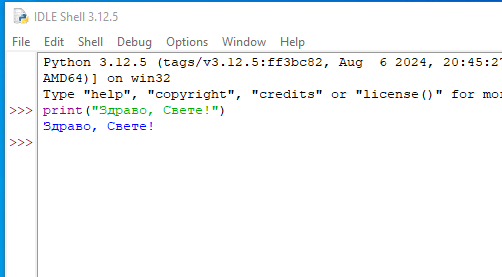
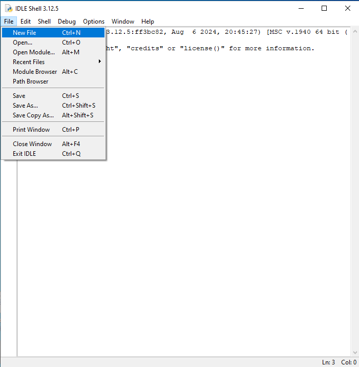
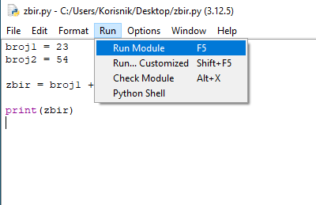
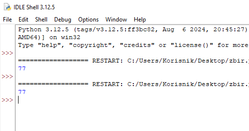

===================================
Преузимање и инсталација Пајтона
===================================

1. Са следећег линка праузми инсталациони фајл за Пајтон на Windows оперативним системима:

https://www.python.org/ftp/python/3.12.0/python-3.12.0-amd64.exe

2. Изабери фолдер у којем ће се инсталациони фајл сачувати и притисни на Save. Уколико ти се не 
отвори овај прозор, највероватније је фајл аутоматски сачуван у Downloads фолдеру.

.. image:: ../../_images/python_download.png
  :width: 800
  :alt: Alternative text
  
  
3. Покрени сачувани инсталациони фајл.

4. Уколико немаш већ инсталирану актуелну верзију Пајтона, појавиће ти се прозор у којем пише Install Python. Штиклирај Add python.exe to PATH а затим кликни нa Install now.

.. image:: ../../_images/python_installnow.png
  :width: 800
  :alt: Alternative text
  
  
5. Сачекај да се инсталација заврши, затим кликни на Close. Овиме си успешно завршио/ла инсталацију Пајтона!

Обрати пажњу на чињеницу да је у нашем случају оперативни систем Windows 11, али то не мора бити тако и на твом рачунару. 
Уколико ти је потребна помоћ да инталираш окружење за рад на свој оперативни систем, пиши нам на raspetljavanje@petlja.org

У наставку прелазимо на даља подешавања радног окружења. Не брини, овај део је само једном потребно урадити. 
Сваки следећи пут када будеш почињао/ла са радом, прескочићеш ове прве кораке.

<<<<<<< HEAD
=======
Python IDLE (Integrated Development and Learning Environment) је основно окружење за развој и учење Пajтона које је инсталирано заједно са Пajтонom. Ево кратког упутства како да се ради у њему:

1. Покретање *IDLE*-а

- Након инсталације Пајтона, можете покренути *IDLE* из менија Start (или на рачунару) тако што ћете га пронаћи као „IDLE (Python [верзија])“, или преко иконице на Десктопу. Када покренете *IDLE*, отвориће се *IDLE Shell* прозор.

2. Основни рад у *Shell*-у

- У *Shell*-у можете одмах писати и извршавати једноставне Python команде. На пример:
  
.. activecode:: input1  
   :coach:
   
   print("Здраво, Светe!")
  
- Након што притиснете Enter, IDLE ће одмах извршити команду и приказати резултат.

----------------------------------------------------- 

----------------------------------------------------- 

3. Креирање новог Пајтон фајла

- Да бисте креирали нови Пајтон програм, идите на „File“ -> „New File“. Отвориће се нови прозор где можете писати свој код.
- Након што напишете код, можете га сачувати као фајл са `.py` екстензијом (нпр. `program.py`).

----------------------------------------------------- 

----------------------------------------------------- 

4. Извршавање Пајтон кода из фајла

- Када завршите са писањем кода, можете га покренути из фајла тако што ћете отићи на „Run“ -> „Run Module“ (или притиском на тастер F5).
- Ако ваш код има грешке, *IDLE* ће вам показати где је проблем.

  
-----------------------------------------------------  

.. activecode:: input3  
   :coach:

   broj1 = 23
   broj2 = 54

   zbir = broj1 + broj2

   print(zbir)

  
-----------------------------------------------------  

Откуцан код у едитору:

  
-----------------------------------------------------  

Резултат:

  

-----------------------------------------------------  
  
  

5. Коришћење Пајтон улазних и излазних команди

- Можете користити `input()` функцију за унос података од корисника и `print()` функцију за приказивање резултата. На пример:
 
.. activecode:: input2  
   :coach:
   
   ime = input("Унесите ваше име: ")
   print("Здраво,", ime)
  

Савети за рад у Python IDLE-у

- **Снимање**: Често снимите свој фајл да бисте сачували промене.
- **Препознавање грешака**: IDLE ће вам помоћи са основним информацијама о грешкама и локацији грешке у коду.
- **Боје кодирања**: IDLE користи различите боје за функције, променљиве и коментаре, што олакшава читање кода.

 
>>>>>>> 952d45ee4369e461937bc423532810f45c46051f
