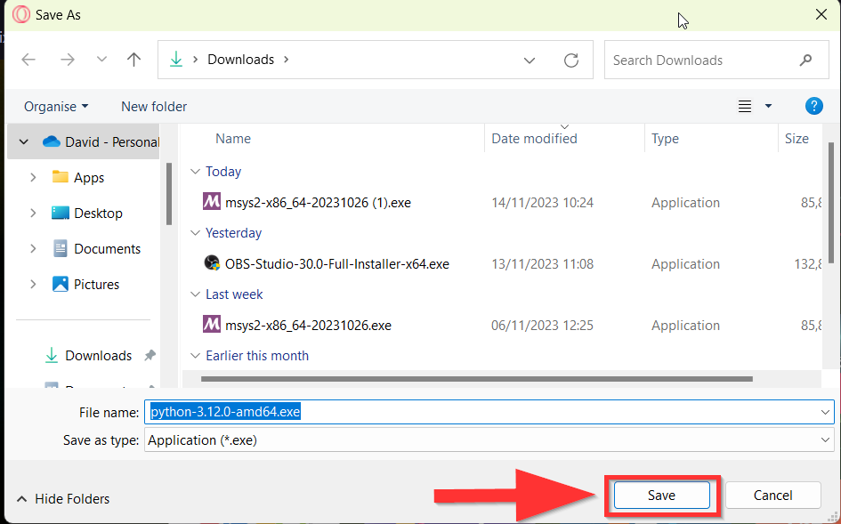
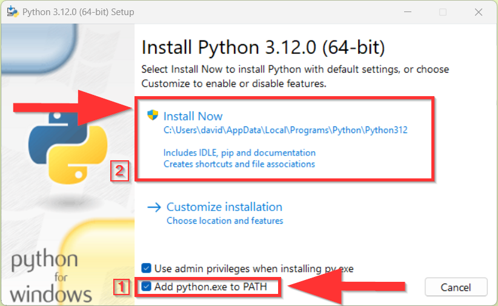

===================================
Преузимање и инсталација Пајтона
===================================

1. Са следећег линка праузми инсталациони фајл за Пајтон на Windows оперативним системима:

https://www.python.org/ftp/python/3.12.0/python-3.12.0-amd64.exe

2. Изабери фолдер у којем ће се инсталациони фајл сачувати и притисни на Save. Уколико ти се не 
отвори овај прозор, највероватније је фајл аутоматски сачуван у Downloads фолдеру.

  
  
3. Покрени сачувани инсталациони фајл.

4. Уколико немаш већ инсталирану актуелну верзију Пајтона, појавиће ти се прозор у којем пише Install Python. Штиклирај Add python.exe to PATH а затим кликни нa Install now.

  
  
5. Сачекај да се инсталација заврши, затим кликни на Close. Овиме си успешно завршио/ла инсталацију Пајтона!

Обрати пажњу на чињеницу да је у нашем случају оперативни систем Windows 11, али то не мора бити тако и на твом рачунару. 
Уколико ти је потребна помоћ да инталираш окружење за рад на свој оперативни систем, пиши нам на raspetljavanje@mg.petlja.org

У наставку прелазимо на даља подешавања радног окружења. Не брини, овај део је само једном потребно урадити. 
Сваки следећи пут када будеш почињао/ла са радом, прескочићеш ове прве кораке.

