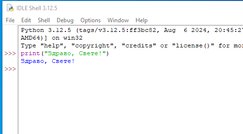
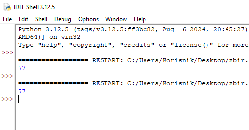

Рад у Развојном окружењу - IDLE Python
======================================================

Python IDLE (Integrated Development and Learning Environment) је основно окружење за развој и учење Пajтона које је инсталирано заједно са Пajтонom. Ево кратког упутства како да се ради у Python IDLE-у:

1. Покретање Python IDLE-а

- Након инсталације Python-а, можете покренути Python IDLE из менија Start (или на рачунару) тако што ћете га пронаћи као „IDLE (Python [верзија])“, или преко иконице на Десктопу. Када покренете IDLE, отвориће се Python Shell прозор.

2. Основни рад у Shell-у

- У Shell-у можете одмах писати и извршавати једноставне Python команде. На пример:
  
.. activecode:: input1  
   :coach:
   
   print("Здраво, Светe!")
  
- Након што притиснете Enter, IDLE ће одмах извршити команду и приказати резултат.

------------------------------------------------------------------------------------------------- 

-------------------------------------------------------------------------------------------------

3. Креирање новог Python фајла

- Да бисте креирали нови Python програм, идите на „File“ -> „New File“. Отвориће се нови прозор где можете писати свој код.
- Након што напишете код, можете га сачувати као `.py` фајл (нпр. `program.py`).

------------------------------------------------------------------------------------------------- 

.. image:: ../../_images/slika1.png
  :width: 400
  :alt: Alternative text
  :align: center

------------------------------------------------------------------------------------------------- 

4. Извршавање Python кода из фајла

- Када завршите са писањем кода, можете га покренути из фајла тако што ћете отићи на „Run“ -> „Run Module“ (или притиском на тастер F5).
- Ако ваш код има грешке, IDLE ће вам показати где је проблем.

  
-------------------------------------------------------------------------------------------------  

.. activecode:: input3  
   :coach:

   broj1 = 23
   broj2 = 54

   zbir = broj1 + broj2

   print(zbir)

  
-------------------------------------------------------------------------------------------------  

Откуцан код у едитору:

.. image:: ../../_images/slika3.png
  :width: 400
  :alt: Alternative text
  :align: center
  
-------------------------------------------------------------------------------------------------  

Резултат:

  

-------------------------------------------------------------------------------------------------  
  
  

5. Коришћење Python улазних и излазних команди

- Можете користити `input()` функцију за унос података од корисника и `print()` функцију за приказивање резултата. На пример:
 
.. activecode:: input2  
   :coach:
   
   ime = input("Унесите ваше име: ")
   print("Здраво,", ime)
  

Савети за рад у Python IDLE-у

- **Снимање**: Често снимите свој фајл да бисте сачували промене.
- **Препознавање грешака**: IDLE ће вам помоћи са основним информацијама о грешкама и локацији грешке у коду.
- **Боје кодирања**: IDLE користи различите боје за функције, променљиве и коментаре, што олакшава читање кода.

Рад у конзоли
==================

Конзола је посебно окружење у ком можемо писати команде и добијати резултате од рачунара. Често се користи у програмирању за покретање програма и управљање датотекама. Ево једноставног водича како да почнеш са радом у конзоли:

Како да Отвориш Конзолу?

.. infonote::

   
   На већини рачунара, конзола је већ инсталирана, а можеш је отворити овако:
   
   -Windows: Притисни `Win + R`, откуцај `cmd` и притисни Enter.
   
   -Mac и Linux: Пронађи и отвори апликацију „Terminal“.
   
 
Отворите фолдер у коме се налази ваш фајл, као у примеру zbir.py. У делу путање фајла откуцајте уместо путање команду cmd. као на слици: 
 

.. epigraph:: 

   cmd.
 
 
.. image:: ../../_images/konzola.png
   :width: 800 px
   :alt: alternate text
   
   
   
Отвориће вам се конзола и налазићете се на истој локацији као у Windows-у:

 .. image:: ../../_images/konzola2.png
   :width: 800 px
   :alt: alternate text  

Програм zbir.py покрећете командом:

.. epigraph:: 
   py zbir.py
   

Отвориће вам се конзола и налазићете се на истој локацији као у Windows-у:

 .. image:: ../../_images/konzola3.png
   :width: 800 px
   :alt: alternate text  

Програм zbir.py покрећете командом:

.. epigraph:: 
   py zdravo.py

Како да Затвориш Конзолу
--------------------------------------------

Када завршиш рад у конзоли, можеш је затворити командом:

.. epigraph::
   
   exit
   

 