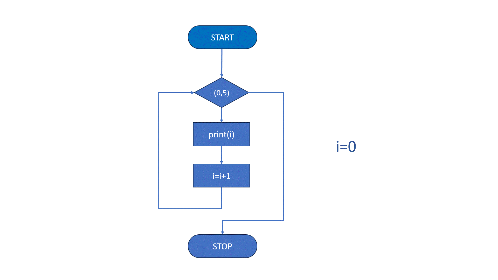

For петља
===========

**For петља** је структура у програмирању која се користи за понављање одређеног блока кода више пута, све док је одређени услов задовољен. Ова петља се обично користи када је познат број понављања унапред.

Синтакса for петље у програмским језицима обично изгледа овако:

.. activecode:: for0  
   :coach:

   for i in range(početna vrednost; uslov; korak):
   
       // Блок кода који се понавља
   

Елементи for петље:

1. **Почетна вредност** – Иницијализује почетну вредност бројача.
2. **Услов** – Проверава се на почетку сваке итерације. Ако је услов испуњен, петља се извршава; ако није, излазимо из петље.
3. **Корак** – Одређује како се бројач мења након сваке итерације.

Пример на Python-у:

.. activecode:: for  
   :coach:

   for i in range(5):
       print(i)

------------------------------------------------------

  
  

Овај код ће исписати бројеве од 0 до 4.

For петља при проласку кроз елементе колекције
---------------------------------------------------

У Пајтону, `for` петља служи за понављање одређених радњи више пута, по елементима неке колекције (као што су листе, речници, скупови, итд.)
или унутар одређеног интервала вредности. Са `for` петљом можемо проћи кроз сваки елемент одређене секвенце и извршити неку радњу за сваки од њих. 
Ово је корисно за обраду великих количина података, омогућавајући да се сваки елемент обради појединачно и са лакоћом, без потребе за додатним 
условима и мануелним праћењем позиције унутар секвенце.

Основна синтакса:

.. activecode:: for1  
   :coach:

   for елемент у секвенца:  
       # овде иде код који ће се извршити за сваки елемент

- `елемент` представља променљиву која узима вредност сваког појединачног елемента из секвенце.
- `секвенца` је колекција елемената кроз које петља пролази.

**Пример 1: Пролазак `for` петљом кроз листу**

Када користимо `for` петљу за пролаз кроз листу у Пајтону, можемо обавити одређену радњу са сваким елементом у листи, редом, од првог до последњег. 

Замислимо да имамо листу бројева и желимо да испишемо сваки број појединачно:

.. activecode:: for2  
   :coach:

   brojevi = [1, 2, 3, 4, 5]

   for broj in brojevi:
       
	   print(broj)

Објашњење:

1. `brojevi` је листа која садржи елементе `[1, 2, 3, 4, 5]`.
2. `for broj in brojevi:` - Овде `for` петља пролази кроз сваки елемент у листи `brojevi`. Променљива `broj` ће редом узимати вредности сваког елемента у листи.
3. `print(broj)` - За сваки елемент (тј. за сваку вредност коју `broj` узме), извршава се ова наредба, која исписује тренутну вредност `broj`.

Резултат исписа:

1
2
3
4
5

Сваки пут када `for` петља прође кроз петљу, она узима следећи елемент у листи и извршава код унутар блока `for` за тај елемент. 
Овим приступом можемо обављати разне операције на елементима листе, попут сабирања, провере услова.

.. activecode:: for3  
   :coach:

   vocе = ["jabuka", "banana", "kruška"]
   for vocka in vocе:
       print(vocka)

Функција `range()` у Пајтону генерише низ бројева и често се користи са `for` петљом када је потребно поновити радњу одређени број пута или проћи кроз бројевни интервал.

**Пример 2:  Испишимо бројеве од 0 до 4**

Користићемо `range(5)` у комбинацији са `for` петљом:

.. activecode:: for4   
   :coach:
   
   for i in range(5):
       print(i)

Објашњење:
1. `range(5)` генерише низ бројева од 0 до 4 (5 није укључено).
2. `for i in range(5):` - `for` петља ће пролазити кроз сваки број у овом низу, и променљива `i` ће узимати вредности од 0 до 4.
3. `print(i)` - Сваки број који `i` узме биће исписан.

Резултат исписа:

0
1
2
3
4

Напомена:
Функција `range()` има и додатне параметре. На пример, можете задати почетну вредност, крајњу вредност и корак:

.. activecode:: for5  
   :coach:

   for i in range(2, 10, 2):
       print(i)

Овај код ће исписати бројеве од 2 до 8 са кораком 2:

2
4
6
8

Коришћењем `range()` функције омогућавамо `for` петљи да лако обради одређени низ бројева, што је посебно корисно када треба 
да поновимо радњу фиксни број пута или када желимо бројеве у одређеном опсегу.

Овде `range(5)` генерише бројеве од 0 до 4 (не укључујући 5).

**Пример 3: Коришћење `range(start, stop, step)`**

Функција `range()` може имати до три параметра:  
- start (почетна вредност),  
- stop (крајња вредност, али не укључена),  
- step (корак, односно интервал).

.. activecode:: for6  
   :coach:

   for broj in range(2, 10, 2):  
       print(broj)

**Пример 4: Угнежђена `for` петља**

Можете имати једну `for` петљу унутар друге. Угнежђена `for` петља подразумева да се једна `for` петља налази унутар друге. 
Ово је корисно када желимо да обрадимо податке у два или више димензија, попут обраде табеле, матрице или прављења комбинација 
елемената из два скупа.

Пример: Испис свих комбинација елемената из две листе

Замислимо да имамо две листе, једну са бојама и једну са предметима, и желимо да направимо комбинације сваке боје са сваким предметом.

.. activecode:: for7  
   :coach:

   boje = ["црвена", "плава", "зелена"]
   predmeti = ["мајица", "панталоне", "капа"]

   for boja in boje:
       for predmet in predmeti:
           print(boja, predmet)

Објашњење:
1. `boje` је листа која садржи три боје: `"црвена"`, `"плава"`, `"зелена"`.
2. `predmeti` је листа са три предмета: `"мајица"`, `"панталоне"`, `"капа"`.
3. Спољашња `for` петља (`for boja in boje:`) пролази кроз сваки елемент у листи `boje`. За сваки елемент у `boje`,
унутрашња `for` петља (`for predmet in predmeti:`) пролази кроз сваки елемент у листи `predmeti`.
4. `print(boja, predmet)` - За сваку комбинацију боје и предмета, исписује се тренутна комбинација.

Резултат исписа:

црвена мајица
црвена панталоне
црвена капа
плава мајица
плава панталоне
плава капа
зелена мајица
зелена панталоне
зелена капа

Како функционише:

- Спољашња петља бира једну боју и почиње унутрашњу петљу.
- Унутрашња петља затим пролази кроз све предмете са том бојом, стварајући комбинације.
- Када унутрашња петља заврши са свим предметима за једну боју, спољашња петља узима следећу боју и унутрашња петља почиње изнова са свим предметима.

Угнежђене `for` петље омогућавају обраду сложених комбинација.

**Пример 5: `for` петља и `else`**

`else` блок може бити коришћен са `for` петљом. Он ће се извршити када се заврши петља, осим ако није дошло до прекида `break` наредбом.

.. activecode:: for8  
   :coach:

   for broj in range(3):  
       print(broj)  
   else:  
       print("Петља је завршена!")

Кључне ствари које треба запамтити:  
- `for` петља у Пајтону служи за понављање кроз елементе неке колекције или интервала.  
- Може се комбиновати са `range()` функцијом за генерисање низа бројева.  
- Може се користити `else` блок за додатне радње након завршетка петље.

`For` петље су моћан начин за обраду података у Пајтону, посебно када треба да прођете кроз велике количине података на ефикасан начин.