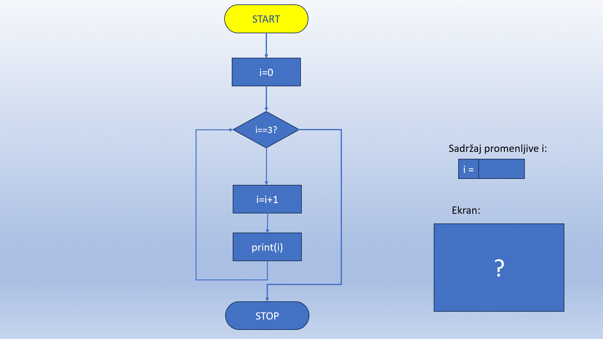

While петља
============

У Пајтону, `while` петља се користи када желимо да понављамо одређени блок кода док неки услов остаје тачан. 
Ова петља ће наставити да извршава код све док је услов `True`. Када услов постане `False`, петља се прекида и 
прелази се на остатак програма.

Основна синтакса:

.. activecode:: while1  
   :coach:

   while uslov:  
       # код који се извршава док је услов тачан

`Услов` је логички израз који се проверава пре сваког проласка кроз петљу. Петља ће се наставити све док је вредност услова 
`True`. Када услов постане `False`, извршавање петље се прекида, и програм наставља са наредбом која долази након петље. 
Ова провера услова омогућава да петља ради само док су испуњени одређени услови, што је важно за контролу понављања и 
спречавање бесконачног извршавања кода.

**Пример 1: Једноставна `while` петља**

Овај пример ће штампати brojеве од 0 до 2.

.. activecode:: while2  
   :coach:

   i = 0  
   while i <= 3:  
       print(broj)  
       i = i + 1

Овде петља траје док је вредност променљиве `broj` мања или једнака 3. Након сваког проласка, `broj` се увећава за 1.

Погледај следећу анимацију:

**Пример 2: Бесконачна `while` петља**

Ако услов у `while` петљи увек остаје тачан, петља ће се извршавати бесконачно, што може довести до проблема ако се не заустави. У наставку је пример бесконачне петље:

.. activecode:: while3  
   :coach:

   while True:  
       print("Ова петља траје заувек!")

**Напомена**: Да би се зауставила оваква петља, користимо неку форму прекида, попут наредбе `break`.

**Пример 3: Коришћење `break` у `while` петљи**
Наредба `break` се користи за превремени прекид петље, чак и ако услов још увек важи.

.. activecode:: while4  
   :coach:

   broj = 1  
   while True:  
       print(broj)  
       if broj == 3:  
           break  
       broj += 1

Ова петља би теоретски трајала заувек, али када променљива `broj` постане 3, `break` наредба прекида петљу.

**Пример 4: Коришћење `continue` у `while` петљи**

Наредба `continue` прескаче остатак кода у тренутном проласку петље и прелази на следећи пролазак.

.. activecode:: while5  
   :coach:

   broj = 0  
   while broj < 5:  
       broj += 1  
       if broj == 3:  
           continue  
       print(broj)

Када `broj` постане 3, `continue` прескаче ту итерацију, па се broj 3 не исписује.

**Пример 5: `while` петља са `else` блоком**

Слично као код `for` петље, `else` блок се може користити са `while` петљом и он ће се извршити када петља заврши на природан начин (без прекида `break` наредбом).

.. activecode:: while6  
   :coach:

   broj = 1  
   while broj <= 3:  
       print(broj)  
       broj += 1  
   else:  
       print("Петља је завршена!")

Кључне ствари које треба запамтити:  
- `while` петља се извршава све док је услов тачан.  
- Користите `break` за превремени излаз из петље.  
- `continue` се користи за прескакање тренутног проласка и прелазак на следећи.  
- Петља са `else` блоком омогућава додатну радњу након завршетка петље.

`While` петље су корисне када не знамо тачно колико пута треба да поновимо радњу, већ се ослањамо на неки услов који контролише извршавање петље.